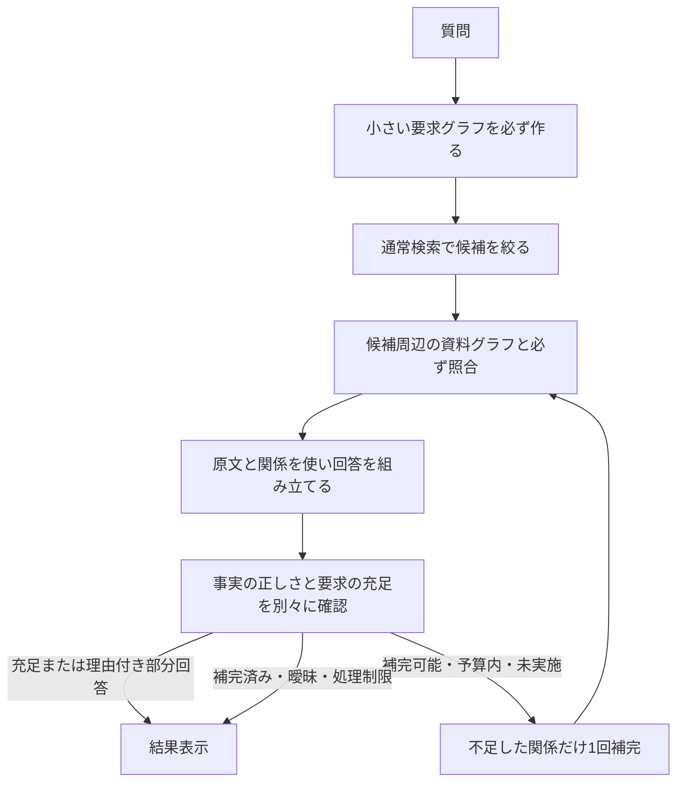

# Local Memory Search：軽量な質問グラフ照合を必ず通す計画

2026-09-23 / LMS-LIGHT-GRAPH-20260923 / v0.1

初版の状態：提案・調査のみ。以下1〜8節は当初の提案を保持する。後続のユーザー承認と今回実施した限定的な接続作業は9節に記録する。全工程の完了・アプリ反映の承認として読み替えない。

## 1. 結論と目的

**小さい質問グラフと候補資料の関係照合は毎回行う。広い追加探索と追加推論は、不足があるときだけ上限付きで行う。**

目的はグラフを巨大化することではなく、利用者が必要とする情報を、対象・条件・出典を取り違えず、実用時間内に回答へ運ぶこと。Gemmaに「グラフを使うか」を選ばせず、アプリの実行経路と完成判定で必須化する。自然文の意味解釈の一部には既存のローカルGemmaを利用する。プログラムだけで任意の日本語を完全理解するとは約束しない。

保証の対象は「接続・照合・不足検査を省略しないこと」。意味解釈の正しさ100%、全資料の網羅性、全質問への回答成功の保証とは分ける。

## 2. 現状から分かったこと

- 今回の固定JSON試験では必要な原文が索引に存在し、入力容量変更後にはモデル入力の切り捨てもなかった。しかし曜日が回答から抜け、案内文のプレースホルダーが残った。最終監査は事実支持を認め、実用上の不足を検出できなかった。
- `question_evidence_graph.py` は集計・既知の項目照会・特定の順序照会以外を `unknown/unsupported` として返す。今回の質問グラフは空。「処理が重いので外した」という原因・経緯は、今回の調査では確認できていない。
- 今回の索引のグラフは主に構造と由来の関係であり、必要な対象・属性・条件の意味関係を、そのまま全部備えているわけではない。
- 別の `workflow_relation_reasoner` は関係抽出・説明・自己点検で最大3回のモデル呼出しを行う。これを全質問に上乗せする案は採らない。主体・行動・手順に限定した語彙も、汎用資料へそのまま強制しない。
- 通常経路の既存の質問整理、候補検索、項目処理、原文参照検査、最終監査、出典位置・入力到達ログは再利用できる。

参照：`local-memory-snapshot-app-test-20260923.md`、`answer_local_memory_v2.py`、`question_evidence_graph.py`、`workflow_relation_graph.py`、`workflow_relation_reasoner.py`、`app/final_answer_audit.py`。直近80.7秒は1条件1試行・回答不合格であり、完成版の性能基準値とは呼ばない。

## 3. 旧方針との差と承認境界

- 今の経路：質問によってグラフが未対応となり、通常検索と短い原文の投影だけで回答が完了し得る。
- 変更案：全質問で小さい要求グラフを作り、通常検索で絞った根拠との関係照合と充足確認を必ず通す。重い広域探索は不足時に限る。
- 利用者への影響：単純な質問にも少量の処理が加わる見込み。一方、資料を全部読み直すことや、重い多段モデル処理を毎回追加することは避ける。速度改善は未測定。
- 変更しない場合：入力容量の問題を解消しても、今回のような短い抜粋・未対応グラフ・不足の見逃しが残る。
- 保持するもの：通常検索、ローカルGemma、原文・採用版・安全区分・出典検証、固定JSON、既存の専用グラフ経路。クラウド、追加モデル、SemIf/Jev、全画像精読は含めない。
- 戻し方：承認後も分離した比較経路として実装し、既存の原本・索引・設定・アプリを保持する。実験失敗を理由に元資料や既存の期待値を変更しない。

これは「不足時だけグラフ」という旧方針に対し、軽い照合を毎回行う明示的な変更案。ユーザーの今回の計画依頼を実装開始の承認へ読み替えない。AGENTS.mdや既存計画の保護条項を本書で書き換えない。

## 4. 提案経路



すべて設計提案であり、現在動作済みの経路図ではない。質問グラフは要求、資料の意味エッジは原文から得た候補であり、どちらもその存在だけで事実として採用しない。

### A. 質問グラフ：既存の質問整理1回を活用

既存plannerに、質問の対象、求める関係、明示条件、欲しい答え方、その根拠となる質問中の表現を短い構造で返させる。ID付与・ノード作成・エッジ接続・整合性検査はアプリ側で行う。長いグラフJSONをモデルに一から作文させない。

- ノード例：対象、必要事項、条件、値の空欄、回答形式。主語・担当者を全質問の必須項目にしない。
- 関係例：質問が必要事項を要求する、必要事項が対象の属性を求める、条件が要求の範囲を限定する。
- 固定の業務名や少数の既知属性だけで振り分けない。未対応の関係名も原文ラベルと未確定状態を持つ汎用の要求として残す。
- 質問に書かれた要求を検索前にID付きで固定する。資料から判明する必要な適用条件は別の「根拠由来の補足条件」として追加し、質問自体を書き換えない。
- 意図が曖昧なら未確定を残す。答えが変わる曖昧さだけ一問確認し、毎回確認会話を増やさない。
- `unknown` が「照合不要」になる経路は作らない。解析失敗時は失敗として表示し、元の質問を保持する。中身のないグラフを作って成功と称するのも不可。

### B. 資料グラフ：固定JSONから必要な周辺だけ取り出す

通常検索の候補を入口に、同じ行の値セル・見出し、段落の所属見出し、明示参照先、関係する注記を束ねる。まずコードで確実に作れる構造を使う。初回から全資料の意味グラフをLLMで作り直さない。

意味エッジは「同じ行だから」では確定しない。対象、関係、値、適用条件、肯定/否定、出典を組として扱う。明示された対応は規則で候補化し、自然文で判断が必要な対応は既存の項目処理でGemmaに確認させる。

構造関係、意味候補、確認され採用した意味関係を別状態にする。エッジは端点、関係名、根拠のEvidence IDと原文位置、明示/推論の区別を保持する。対応が分からないときに、意味エッジをでっち上げない。

重複する原文は一度だけ渡し、グラフからはIDと文字位置で参照する。元のJSONは変更しない。派生関係のキャッシュは、snapshot/索引世代・原文hash・範囲・抽出仕様・モデル条件に結合し、変更時には失効する。質問や要求に依存する抽出・照合結果は要求グラフのhashもキーへ含め、質問に依存しない資料関係と区別する。初期試験はキャッシュなしでも成立させ、再利用を合格の前提にしない。

### C. 照合：形だけでなく、意味を表す組を比較する

アプリが必ず「要求ID → 候補の対象・関係・値・条件 → 出典」の対応表を作る。対象の一致、関係の向き、時点・版・単位・否定・例外を保つ。語やEmbeddingの類似は候補選定であって、正しい意味の結合を保証する点数ではない。

Gemmaへ渡す前に構造と既存の意味候補を照合し、既存の一括項目処理で自然文の関係候補と回答案を得た後、アプリが再度その参照・関係対応を検査する。最終監査へは原文も渡す。同じ処理の中で提案した関係を、提案しただけで検証済みにしない。

照合結果は `connected_candidate / ambiguous / evidence_not_found / scope_limited / processing_failed` 等に分ける。候補が接続できたことと回答の採用・充足は別。検索で見つからないことを「資料に書かれていない」と断定しない。

### D. 回答と監査：短い引用の一覧から、根拠付きの組立へ

既存の一括項目処理を、短い値の抜粋だけでなく「要求別の説明・原文引用・使った関係ID・不足」を返す比較経路へ拡張する。これは既存の出力契約の変更であり、単なる内部リファクタリングと称しない。

- 原文の引用と、説明として組み立てた文を分離する。原文を言い換えて引用扱いにしない。
- テンプレートの空欄を埋める場合は、同じ対象・版・適用条件を支持する根拠が必要。確定できなければ空欄があることを明示し、使える案内が完成したとは判定しない。
- 最終監査の呼出しは既存の1回を使い、「述べたことが正しいか」と「求められたことを満たすか」を別結果で返す。元の質問と原文も照合し、質問計画自体の取りこぼしを点検する。
- アプリは各要求IDについて、根拠・採用関係・回答箇所または未解決理由があることを機械検査する。意味が正しいかの監査は別に必要。
- 結果は、回答完了、根拠付き部分回答、意図/資料の曖昧さによる確認、確認範囲不足、処理失敗を区別する。全部を「わかりません」にしない。

## 5. 軽さを守る予算案

数値は実装・測定前の提案値。既存のhard timeoutや入力容量を勝手に変更する許可ではない。

| 項目 | 初期比較での案 |
| --- | --- |
| 通常の文章生成モデル呼出し | 現行の質問整理1回＋一括項目処理1回＋最終監査1回を基本とし、常時追加しない。Embedding呼出しは別集計 |
| 初回の周辺探索 | 通常検索候補から構造辺1段程度。表の行・列見出しと値、段落・見出しを一まとまりで扱う |
| 原文束の範囲 | まず重複のない最大12ブロックを仮の比較上限にする。ブロック数だけでなく入力容量と必要な関係の到達も検査する |
| 不足時の補完 | 必須要求の未接続または参照先の不足に対し、追加検索1巡・最大2段の関係探索。無関係な全資料精読に広げない |
| 補完時の追加モデル処理 | 再組立と再監査の最大2回を含め、1質問全体で最大5回。旧個別fallbackをさらに積み上げない。変更経路だけで適用し既存経路の動作は保持 |
| 入力 | snapshot通常8192、既存workflow16384を勝手に縮小しない。原文重複を削り、必要関係・否定・例外を黙って切り落とさない。出力余裕と実トークン到達を確認 |
| 時間目標 | 直接質問は90秒以内を初期比較目標、複合質問は180秒を目標、従来の実用目安3〜5分を上限評価に使う。達成保証ではない |

通常の3回で完成できることを先に試す。補完の回数上限を設定しても、既存の時間上限を超えてよいことにはならない。残り時間に生成・監査を収められないときは補完を開始せず、確認できた内容と制限を表示する。失敗や形式不正で個別再試行へ分裂させない。新経路の上限・失敗処理は実装カードと合成試験で固定する。

新しい比較経路の呼出し上限は、内部から呼ぶ専用グラフ経路・workflow・個別fallback・形式修復・別監査モデルも含む、すべての文章生成モデル呼出しを合算する。別々のカウンタで上限を迂回しない。入口で実行経路を選び、旧重処理と新比較処理を重複起動しない。

上限を超えたら要求を勝手に削らない。巨大な表、長い手順、全件回答などは「確認範囲が足りない」と記録し、範囲の分割・追加確認へ。必要関係を保持できない単なるtop-k切断は不可。制限の厳しさで過剰保留が増える場合も不合格とする。

常時モデル呼出しを増やさなくても、入力・出力量が増えれば遅くなる。コード側のグラフ組立・照合時間、Embedding、モデル読込、質問整理、組立、監査、補完を分けて計測する。現在のコードには全索引を走査する経路もあるため、グラフが小さいだけで検索が一定時間になるとは言わない。

## 6. 「必ず通した」を検証する記録

各要求に以下を残し、空欄があれば完成判定しない。

1. 質問要求とその出どころ。
2. 作成した質問ノード・エッジ。
3. 候補資料の関係と原文位置。
4. 実行した照合と未接続理由。
5. モデルへ実際に渡した原文・関係ID。送る予定だったものだけでは不可。
6. 回答に採用した関係と回答箇所、または理由付きの未回答。
7. 事実支持と要求充足それぞれの判定。

`graph_built / match_attempted / graph_delivered / relations_adopted / requirements_checked` を区別する。`graph_used=true` を記録するだけで合格にしない。構造参照しか使っていない場合は意味関係の採用と区別して表示する。記録の正常性は意味解釈の真値を保証しない。

## 7. 実装順と小さな合否判定

| 工程 | 内容と出口 |
| --- | --- |
| L1 接続の穴を塞ぐ | 汎用の要求グラフと照合状態を追加。未知の言い方でもsilent skipしないことを合成試験で確認。旧count等の専用処理は回帰で保持 |
| L2 根拠と回答をつなぐ | 固定JSONの候補周辺グラフ、意味候補の確認、要求別の回答組立と二種類の監査を接続。普通の3呼出しで解ける小比較を先に行う |
| L3 不足時だけ補完 | L2で分かった未接続に対する1巡補完と予算制御を実装。不要なら補完は走らない。ループ数を増やして成功扱いにしない |
| L4 利用経路へ反映 | 小比較で品質と速度を満たした場合だけ、試用アプリの入口・実UIに接続する提案へ。アプリ更新は別承認 |

最初の実装カード候補はL1–L2。対象候補は新規の汎用要求/照合ヘルパー、`engine/answer_local_memory_v2.py`、`engine/question_evidence_graph.py`、`app/claim_graph_validator.py`、`app/intent_contract.py`、`app/final_answer_audit.py`、分離テストハーネスと対応する新規テスト、本計画の結果欄。既存部品の再利用を優先し、正確な編集集合と試行予算を承認前にカードへ確定する。workflow実装全体やReader、原資料、固定JSON、既存索引を同時改修しない。

試験は次の順序で行う案。現時点では実行しない。

- 先にモデルなしの契約・異常系試験。配線、参照、ID、原文不変、予算到達、版混在、未対応質問が抜け道にならないことを確認。
- 実Gemma比較は既存R1–R2の4問（稼働時間と案内、年齢別料金、注意事項、基本手順）を再利用。期待する必要事項・出典・正当な留保を事前固定し、モデルや索引へ正解表を渡さない。
- 一度に4問を回さず、まず今回の失敗1問で接続・実用回答・時間を確認。合格すれば残り3問へ。不合格なら原因を報告して止める。
- before/after各4問以内。同一条件の既存ログが使えるbeforeは再実行しない。既存試行回数をリセットせず、新しい比較の許可分として記録する。修正後の追加比較は別途範囲を説明して承認を得る。
- 汎用性確認はカフェ以外の合成資料で、主語なし、別表参照、否定・条件、同時刻の別対象、未解決の空欄、巨大表、未読、版競合を含める。配線のmock成功と実モデルの意味解釈成功を区別する。実モデルの汎用性比較は別段階で最大4問の枠を提案する。
- L1–L2の結果が良ければ、代表2問の再利用なし/ありを追加比較する案を提示し、初回・反復の速度を区別する。4問だけで一般正答率や恒常的な速度改善を主張しない。

合格は「グラフができた」ではなく、必要事項と原文根拠が回答に残り、誤結合せず、正しい留保ができ、実用目標に近づくこと。要求ごとの充足、誤答、正当な部分回答/保留、過剰保留、処理失敗、出典不一致、所要時間を別々に記録する。

## 8. 設計上の反証・採否

- 全文の意味グラフを先に完成させる案：初回読取の重さが再発するため、今回の主経路には採らない。
- 重い既存workflowを全質問で起動する案：追加モデル処理と手順専用の意味型を広く持ち込むため採らない。
- コードの規則だけで全意味を確定する案：任意の自然文に対応できる保証がなく、誤結合の危険があるため採らない。
- 型や語の類似だけでグラフ一致とする案：別対象・例外・時点の混同を防げないため採らない。
- 機械検査だけで要求充足を承認する案：IDが埋まっても意味が違う可能性があるため採らない。
- 全未対応を拒否する案：速くても実用性を失う。確認済み部分の回答と未解決理由を分け、過剰保留を測る。

この反証を踏まえ、**毎回の小さな照合は省かず、毎回の大きな推論は増やさない**案を最初の比較対象とする。役割の追加で通常経路が遅くなりすぎた場合も、グラフを黙って外さず、測定結果と変更案を利用者へ戻す。

## 9. 承認済み意図の接続：実施記録

作業ID：`LMS-INTENT-CONNECTION-01` / 2026-09-23。

承認根拠：ユーザーが、既存の意図理解の資産を活用する説明に対して「では、その方向でお願いします。その後に検証をしてみたいです」と指示。最初の単位として、確認済み意図を再作文せずに検索・監査へ渡す接続と、モデルなしの分離試験を実施する。L1全体・L2完了、通常画面への切替、配布アプリ更新とは分ける。

編集集合：`engine/intent_requirement_graph.py`（新規）、`engine/answer_local_memory_v2.py`、`app/intent_contract.py`、`app/local_memory_server.py`、`app/final_answer_audit.py`、`tests/test_intent_requirement_graph.py`・`tests/test_intent_graph_connection.py`・`tests/test_intent_graph_transport.py`（新規）、本書およびcontrolled-execution-planの承認記録。作業前からある差分は保持する。

実施しないもの：原資料、固定JSON、本番・比較索引、CONFIG、使用中アプリ、Readerの変更、再取込、モデル取得、commit/push。今回は実モデル呼出し0回。旧比較の回数をリセットしない。

### 再利用した資産と実装

- 既存の `intent_contract` の質問・目的・1〜8要件、署名、期限、資料世代確認を活用する。
- 旧 `build_question_understanding.py` の「原文と解釈を分離し、コードでID・hashを作り、モデルに勝手な権威を与えない」原則を再利用。旧compiler全体は質問原文のみを扱う多数の型・validator依存があり、承認済み目的の追加や主語省略をそのまま通せないため、実行依存として移植していない。
- 専用の「意図推定スキル」が自動的にGemmaへインストールされるわけではない。既存Codexスキルの指示と、実アプリの実装を区別する。
- 原質問Q1・目的G1・要件R1〜R8と、明示された `expresses_goal / requires / scopes` の関係を作る。これは**ユーザー要求のグラフ**。資料の意味グラフではない。
- `--intent-contract-stdin` は私的なstdinで契約を受け取り、要求本文を切り捨てず全要件を項目へ結び付ける。`--audit-mode batched` 専用。旧plannerによる再分解・5件制限・補助項目削除を通さない。既存の一意回答指定の部分回答禁止も保つ。
- 原質問・目的・要件のグラフを、重複させずモデル入力へ渡す。最終事実監査にも渡すが、事実支持と要求充足を混同しない。原文引用と安全検査は維持。
- serverの `answer_query(..., confirmed_intent=...)` から試験できる。エンジン直後と最終監査後に、契約・質問・グラフ・項目ID対応を再検査する。
- 既存の充足結果にもR番号と契約hashを付ける。キャッシュキーは意図・世代の違いを区別するが、回答キャッシュ自体の再利用無効化は維持。
- 追加のplanner呼出しは0。batch失敗を最大8回の個別再試行へ拡大しない。通常の入力容量は8192を明示し、既存workflowの16384は縮小しない。既存guardで未終了・打切り・使用量欠落・容量到達を失敗にする。
- 送信した質問グラフのhash、入力候補ID、実HTTP応答・使用量と各要件の処理状況を記録。配送・容量統計は意味理解の証明ではなく、事前の正確なトークン化による入力全体の非切捨て証明でもない。その未検証状態も残す。

### 分離検証の結果と残件

新規の純粋・接続・搬送テスト27件合格。署名・期限・世代、8要件保持、改ざん・脱落・順序変更、汎用要件でも原質問が届くこと、一意指定の保持、batch失敗時の非増殖、監査後も契約が維持されることを確認。実モデルではなくtransport mockによる接続試験であり、回答精度・速度の合格ではない。

既存回帰を含む広い試験では、初めに使用したPythonでjsonschema等の依存不足が発生。既存 `.venv-paddleocr` と `PYTHONPATH=tests:scripts:rag` で再実行して確認する。依存の新規取得はしていない。HTTPフォーム試験は使用中ポートではなく、合成資料の一時localhostポートで行う。

最終再実行：267件合格（7.196秒）。`git diff --check` も通過。意図契約・搬送・接続、既存の質問理解runtime、専用QEG、相対時点、回答可能性、案内文の既存テストを含む。全テストが全機能の意味精度を保証するわけではなく、下記の新経路の専用QEG接続残件は解決済みに数えない。

再現コマンド：

```sh
PYTHONPATH=tests:scripts:rag .venv-paddleocr/bin/python -m unittest -q test_intent_contract test_intent_transport_budget test_intent_requirement_graph test_intent_graph_connection test_intent_graph_transport test_intent_coverage_audit test_answerability_integration test_answerability_gate test_question_graph_runtime test_generic_question_graph test_ordered_section_question_graph test_temporal_question_plan test_record_lookup_question_graph test_question_evidence_graph test_question_graph_executor test_grounded_guidance
```

**L1全体はまだ未完了。通常HTTPフォームは旧経路を維持し、新しい契約経路へ自動切替していない。** 独立監査で、新しい汎用要件を旧QEGへ直接渡すと、担当者・単価等の専用field契約が `record_lookup_field_not_supported` になる事例を確認した。

次に必要なのは、承認済み要求を不変のまま保持し、専用グラフ検索に必要な作業単位を別に作る対応表。一つの要件が複数の値や案内を求める場合も、要求を一つの値へ縮めない。相対時点・資料版・一意性の既存安全条件をその対応表へ引き継ぎ、最終監査で再構築照合する。既知fieldの門を無効にする方法では解決しない。

資料側の一般的な意味関係の抽出・照合、要求ごとの説明組立、充足検査の統合はL2の残件。traceには `semantic_relation_matching=not_implemented_in_this_stage`、`relations_adopted=false`、`requirements_checked=false` を明示する。新しいノードが存在するだけで「GraphRAG完成」と判定しない。

専用経路との対応を直した後、既存のバリスタ質問1問を同じ固定JSONで比較し、曜日・時刻・案内に必要な情報・未解決のテンプレート空欄・所要時間を検査する。今回の接続試験はその比較の代わりではない。比較合格前にアプリ更新はしない。

### 2026-09-23 続行：要求と検索作業の対応表

作業単位 `LMS-INTENT-WORK-MAPPING-01`。ユーザーの「よし、それじゃあ本筋に戻りましょう」に基づき、上記残件の対応表から続行した。編集対象は `engine/intent_requirement_graph.py`、`engine/answer_local_memory_v2.py`、`tests/test_intent_work_mapping.py`、`tests/test_intent_graph_connection.py`、本結果欄。原資料・JSON・索引・設定・アプリ・commit/pushは変更しない。

- 各要求R番号に、原要求全文を扱う必須の作業を一つ残す。その下に既存QEGのfield辞書に一致する検索候補を関連付ける。一つの要求に担当者・単価・案内が含まれていても、担当者一件で要求全体を完了にしない。
- field候補は単語の一致にすぎない。否定や別対象の可能性があるので意味検証済みにせず、`satisfies_requirement=false` とする。未知の言い方も要求全文を残す。同じfieldでも別要求の対象を勝手に統合しない。
- 原質問・目的・資料世代・一意指定を保持し、要求本文中の相対時点も保持する。相対時点の解決を今回新たに行ったわけではない。
- 契約・辞書・対応表のhashと再構築照合を用意し、比較経路の追跡記録へ出力する。モデル呼出しの追加なし。
- **今回できたのは対応表と追跡記録まで。検索へのdispatch・専用QEGとの接続修正はまだしていない。** `execution_status=mapping_only_not_dispatched` を明示する。旧QEGのfield不一致を解消済みにせず、既存の停止条件を保持する。再構築検査関数は単体・接続試験で検証したが、最終監査での対応表の再検査への接続は残件。

分離・回帰試験151件合格。新規10件は複合要求、未知関係、否定表現、別対象、相対時点・一意指定、8要求、表示ラベルより長い原文、英字境界、改変・辞書変更、非実行状態を検査。実Gemma比較は今回は0回。次は、この候補を既存の専用検査へ接続し、要求全体の未完了を保ったまま検索結果を受け取る処理。対応表を作っただけでL1/L2合格・GraphRAG完成としない。

### 2026-09-23 続行：候補検索と元要求への配送

作業単位 `LMS-INTENT-LOOKUP-DISPATCH-01`。直前の「対応表を検索処理につなぐ」という次工程に対する「よし次行こう。もう一度方針を確認した上で、次に行きましょう」に基づく。方針は、意図保持・小さな質問グラフ・通常検索の再利用・原文根拠・事実支持と充足の分離。全資料の意味グラフ化、常時の追加モデル処理、業務特化はしない。「それって本当？」の最終再照合も維持する。

編集集合：`engine/intent_requirement_graph.py`、`engine/answer_local_memory_v2.py`、`app/final_answer_audit.py`、`tests/test_intent_lookup_dispatch.py`（新規）、本結果欄。他の既存差分は保持。原資料・固定JSON・索引・CONFIG・アプリは変更せず、モデル取得・commit/pushなし。今回はモデルなしの合成試験のみ。

実施内容：

- 対応表から専用lookup用のW項目を派生し、既存QEGのbuild/validateを実行。原質問は書き換えず、元のF要求も残す。全候補fieldを一緒に渡し、既存の「要求されたfieldが欠けている」検査を迂回しない。別要求の同一fieldも統合しない。
- `ready`かつ`pass`の出典IDだけを対応するFの検索候補へ追加。元の検索順・primary QEG・単一値照合・版確認の停止条件を維持する。索引にない出典、版フィルタ外、モデル入力から落ちた候補を成功扱いしない。
- モデル呼出しの追加は0。専用lookup時間を別記録する。補助候補だけでなく通常検索を含む一括入力の重複除去後も12ブロック上限を検査し、超過時は黙って切らず停止する。既存8192/16384、文字数・出力・タイムアウトは維持。
- 最終監査で対応表・派生plan・専用QEG・候補出典・各Fへの配送記録を再構築照合。新経路の記録は `0.4-intent-candidate-dispatch` とし、dispatch/receiptの欠落で旧記録扱いに落ちないようにする。旧レコードは互換読み取りを維持。これはログ全体の署名・改変耐性を新たに保証するものではない。
- 候補取得とモデルへの配送は、意味理解・説明生成・要求充足とは分ける。`relations_adopted=false / requirements_checked=false` を維持し、whole作業や元の対応表の候補状態を検索成功だけで完了にしない。実行結果は別の `intent_lookup_dispatch` に残す。

検証：合成のProject Atlas資料で担当者・単価の二つの根拠が、条件説明を求める元の要求と共に一回のmockモデル入力へ届いた。実QEGとCLIを通し、primary QEGの複合field停止が残るため回答がinsufficientのままであることも確認した。独立の読取レビューで指摘された合計ブロック上限と記録欠落を補強。新規試験は改変、未配送、容量不足、相対時点、重複field、版競合、未知関係、旧経路互換を含む。

広い回帰試験335件合格（8.124秒）。初回はHTTP用一時localhostポートのsandbox制限で8件が起動前に失敗し、許可された隔離ポートで同一集合を再実行した。さらに新記録のdispatch/receipt欠落を検出する試験1件を追加。実Gemmaの精度・速度比較は0回であり、改善率は主張しない。

**残件：既存のprimary QEGはF要求一件＝単一値一つを前提としており、複合要求では停止が残る。** 今回は候補取得・配送の接続まで完了。次はWの個別根拠検査とF要求全体の説明・充足判定を分離して接続する。既知fieldや版・時点・原文の検査を外す方法では直さない。未知の関係の一般意味照合、説明組立、充足検査、実Gemma比較、アプリ反映は未完了。候補が届いたことだけで実資料への回答成功やL1/L2完了としない。
