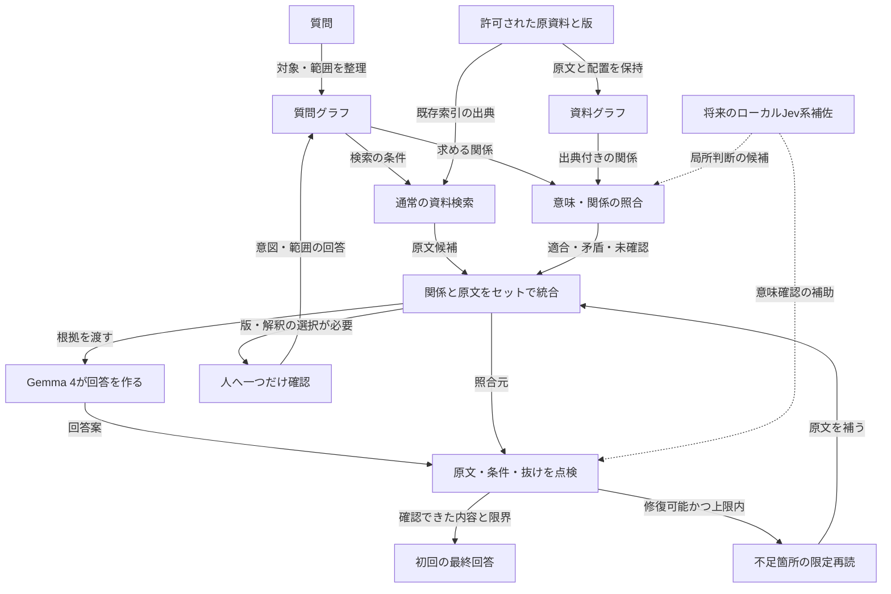

# Local Memory Search：初回回答の品質を優先するグラフ補佐計画

作成日：2026-09-19。計画ID：LMS-QF-GRAPH-20260919。版：1.0。

状態：修正方針の整理・保存。実装、比較試験、本番採用は未実施・未承認。

保存・公開の承認追記（2026-09-19）：後続のユーザー指示「そしたらコミットしてプッシュしよう」により、本書・計画グラフJSON・旧計画への今回の参照追記をコミットし、既存の`origin/codex/visual-classification-v1`へプッシュする。以下の「commit・pushなし」は文書作成時点の範囲であり、この保存・公開だけが追加承認された。実装・追加実験・本番更新は含まない。

## 1. まず、人間向けに一言で

**Gemma 4が回答する前に、質問と資料の「言葉と関係」を照合し、必要な原文・条件・注意事項をそろえる。ユーザーへ見せる前に、上限付きで読み直しと修正を行い、初回から使える回答を目指す。**

- 主役：ローカルGemma 4。グラフも、将来のJev系判定も補佐役。
- 優先するもの：ユーザーの出戻り・再説明・修正負担の削減。
- 許容するもの：効果が確認できる範囲で、初回回答前のローカル計算と待ち時間を増やすこと。
- 変えないもの：完全ローカル、原本保護、原文根拠、版確認、必要なHuman in the Loop。
- 保証しないもの：グラフを使えば正解になること、機械だけで全ての意味誤りを判定できること。

### ユーザーの意図

> 「メインルートはジェマ様」「グラフエンジニアリングシステムもこのJevも補佐的」
>
> 「もともとかなり精度が高そうなやつを一番最初に答えてもらおう」「出戻りが嫌い」
>
> 「質問側のノードとエッジの形」と「データベースの方にあるノードとエッジの形」を意味検索的に照合し、最初から補佐する。

名称は会話の文脈に従いGemma 4へ統一する。Jev公式モデルと、Jevの方式に着想を得たローカル実装は区別する。

## 2. 今回の作業範囲と、旧計画との関係

### 文書作成カード

| 項目 | 今回の範囲 |
| --- | --- |
| 作業ID | DOC-QF-GRAPH-20260919 |
| 承認根拠 | ユーザーの「この修正方針をグラフエンジニアリング処理でまとめて…これからの改善方法の計画書としてまとめて」 |
| 変更対象 | 本書、同名の `.graph.json`、`local-memory-controlled-execution-plan.md`への最新参照追記のみ |
| しないこと | アプリ実装・起動変更、実験実行、索引・CONFIG・原資料の変更、再取り込み、モデル取得、外部推論API、commit、push |
| 文書の合格条件 | 役割・新旧差分・実行段階・評価方法・未確認事項が追える。グラフの参照が整合し、効果を実証済みと書かない |
| 戻し方 | 新規2ファイルを使用しなければアプリは元のまま。参照追記だけを外せる。旧計画と既存差分は保持する |

本書は新しい改善方向の参照先であり、実装開始の許可証ではない。計画遵守・変更承認の保護条項は既存の `AGENTS.md` と `LMS-CONTROLLED-PLAN` に従う。

### 変更点を明示する

| 項目 | 従来の計画 | 今回まとめる設計方針 |
| --- | --- | --- |
| グラフの起動時点 | 通常RAGで不足した場合に照合 | 質問グラフを先に用意し、初回回答の材料収集から資料グラフ照合を使う |
| 通常検索 | 本体の最初の検索 | 引き続き使用。グラフ経路と組み合わせ、取りこぼしを比較する |
| 回答者 | ローカルGemma | ローカルGemma 4のまま |
| ユーザーへの提示 | 不足が残り再質問・修正につながった | 可能な補完・点検・修正を内部で済ませた結果を初回提示する |
| Jev系 | 調査した補助候補 | 将来段階。まずグラフ補佐を検証し、その後で役割・関係の小判断を比較する |
| 評価の中心 | 個別処理・安全検査の成否も記録 | 初回に使える回答の割合、重大誤り、人の修正負担を中心に置く |

「従来の計画」と「実際の現行コード」は同一ではない。既存コードには検索前の質問グラフ処理や別の補助経路がある。本書だけで配線済み・動作成功とは判断しない。また、従来構想も人が失敗を指摘するまでグラフを起動できない仕様ではない。変更の中心は、内部の不足判定を待つ方式から、初回の根拠準備にグラフを使う方式への前倒しである。

待ち時間とメモリ使用量は増える可能性がある。採用しない場合は従来ルートを保持できるが、今回確認された読み落としは別途改善が必要。既存ルートを消さず比較し、悪化した補佐は採用しない。

`AGENTS.md`と旧計画に残る「通常RAG不足時のみ」という記述は、今回黙って書き換えない。後続の実装カードでは、本書に合わせる処理順の改訂箇所も具体的に示す。保護条項を緩めず、実装する範囲についてユーザーの明示指示と照合する。旧T0〜T8等を自動再開しない。

## 3. 確認できた事実と、まだ仮説の部分

根拠：[2026-09-19のGemma実機試験](local-memory-gemma-workflow-test-20260919.md)。これは人が正解の資料範囲を選んだ入力比較であり、自動検索やGraph RAGの成功試験ではない。

この試験報告書はローカル参照資料で、今回の公開対象には含めない。GitHub上ではリンク先が存在しない場合がある。以下の表に計画判断に必要な結果を記録し、原資料本文・試験の生データは公開しない。

| 区分 | 内容 | 計画への反映 |
| --- | --- | --- |
| 観測 | 挨拶だけを渡すと約16秒で部分回答。必要な手順は出なかった | 回答モデルだけでなく、渡す根拠の範囲を検査する |
| 観測 | 受付の構造付き原文を渡すと約57秒で主要な流れを説明。ただし欠落・役割混同あり | 原文のまとまりを渡す価値はあるが、これだけで合格にしない |
| 観測 | 抽出→説明は合計約143秒。参考欄と担当の情報が落ち、網羅性が後退 | 処理段数や時間を増やすだけでは品質向上しない |
| 観測 | 引用の文字列一致検査が通っても意味的に不合格 | 機械整合・意味の正しさ・必要事項の充足を分離する |
| 仮説 H1 | 質問・資料グラフの意味と関係の照合を回答前に行うと、必要な根拠を集めやすくなる | 通常検索との比較で確かめる。類似度を正解確率にしない |
| 仮説 H2 | 原文と、条件・発話・作業・注意の区別を一緒に渡すと混同が減る | 原文を残した比較試験で確かめる |
| 仮説 H3 | 限定再読と修正を初回提示前に行うと、人の出戻りが減る | 修正回数だけでなく、誤り・待ち時間・人の作業時間も測る |
| 仮説 H4 | Jev系の有限選択肢判定が局所的な照合を助ける | 将来の別実験。H1〜H3の前提条件にしない |

他の原因候補として、読取欠損、検索範囲、質問解釈、条件・担当の抽出、生成時の省略、監査による削り過ぎを分ける。モデル性能だけ、グラフ未使用だけを唯一の原因と断定しない。

## 4. Graph Engineeringで整理した構造

- Mode：Problem Solving。
- Goal：原資料から必要な手順・条件・注意事項を説明し、人の修正なしで使える初回回答を増やす。グラフ生成そのものを完了条件にしない。
- Complexity：L。計画グラフ16ノード、主要経路3本以内。
- 機械可読の計画データ：[ノード・エッジJSON](local-memory-quality-first-graph-plan-20260919.graph.json)。これは設計整理用であり、本番の資料グラフ・実行設定ではない。

### 4.1 質問側と資料側は別物

| 側 | ノードの例 | エッジの例 | 必ず保持するもの |
| --- | --- | --- | --- |
| 質問グラフ | 対象、場面、知りたい行為、条件、未知の回答要素 | 対象と範囲、求める関係、条件制約 | 元質問の該当表現、明示／解釈候補、未確定事項 |
| 資料グラフ | 文書、版、見出し、表、セル、原文断片、担当、行為、条件 | 同じ行に属する、条件下で行う、次の行為、担当する | 原文、ファイル・シート・セル等の位置、文書ハッシュ、関係の根拠と生成方法 |
| 照合結果 | 質問要素と資料要素の対応候補、支持された回答材料 | 候補対応、原文支持、矛盾、未確認 | 対応理由、残る不一致、使用・未使用の根拠ID |

質問グラフは「知りたい関係」の表現であり、回答の事実を持たない。質問の希望に合わせて資料側のエッジを作らない。質問グラフや過去回答を資料索引へ混ぜない。

表の「同じ行」「隣の列」「上にある」は観測できる配置関係である。それだけで業務上の「次に行う」「原因」「適用条件」を確定しない。業務関係は原文で確認し、推定なら推定として分離する。

### 4.2 「似ている」を二段階に分ける

1. **候補を見つける類似照合**：語句・意味・部分的な関係パターンから、読むべき場所を探す。埋め込み類似度等は候補順位に使えるが、それ自体は関係の支持を示さない。
2. **原文による関係確認**：主体、関係型、方向、条件、否定・例外、対象範囲、版・時点が質問に適合するかを確認する。

グラフの図形やノード数が同じでも、意味が逆なら不適合。完全なグラフ同型を要求せず、質問が求める関係に対する部分経路を照合する。検索で上位にならなかった資料を「存在しない」と扱わない。

グラフが古い・未完成・未読の場合は `unknown` と記録する。「エッジなし」を「その関係はない」に変換しない。通常検索で見つかった原文が十分なら候補として保持し、グラフがないだけで捨てない。グラフ未使用の回答をグラフ検証成功とは表示しない。

### 4.3 提案する処理図（未実装）

図の矢印は主として提案するデータの受け渡しであり、精度向上の因果を証明していない。資料グラフは事前取り込み時の準備候補であり、質問のたびに全ファイルを再読する設計ではない。通常検索とグラフ照合は論理的に独立な候補収集として扱うが、24GB Mac上でGPU推論を無制限に物理並列化しない。

### 4.4 優先する経路

1. **主経路**：質問 → 質問グラフ → 通常検索／資料グラフ照合 → 出典付き原文の統合 → Gemma回答 → 点検 → 初回提示。
2. **修復経路**：具体的な欠落を検出 → 同じ対象・承認版の原文を限定再読 → Gemmaが修正 → 再点検。無限ループにしない。
3. **人の選択経路**：版や意図に実質的な競合 → 違いを短く示し一問だけ確認 → 確認内容を後続へ確実に渡す。

上記は「実装・検証する優先順」であり、実行可能性・効果が証明された経路ではない。Jev系は将来の支援枝であり、主経路を塞ぐ必須依存にしない。

## 5. 各処理の担当とデータの約束

| 担当 | 任せること | 任せないこと |
| --- | --- | --- |
| 決定的なプログラム | 原文取得、出典・版・ハッシュ、行列・見出しの保持、日時比較、文字列一致、上限管理、ログ | 根拠のない業務関係の創作、意味の正しさの完全保証 |
| ローカルGemma 4 | 質問の解釈候補、原文の意味整理、根拠に基づく回答・修正 | 原文や版承認の上書き、資料にないセリフの創作 |
| グラフ補佐 | 質問と資料の関係照合、関連根拠の収集、未確認経路の明示 | 図形類似を正解とすること、回答者の置換 |
| 将来のJev系補佐 | 原文範囲の役割、関係適合、不足・矛盾の小さな選択判断 | 最新版の自動決定、単独の合格許可、クラウドへの資料送信 |
| 人 | 評価基準の確認、重要な版・意図の選択、実用上の正しさの評価 | 毎回の断片選び、同じ読み落としの繰返し指摘を前提にしない |

回答材料には最低限、`evidence_id / source_locator / document_hash / version_state / raw_text / relation_candidates / confirmed_relations / unresolved / coverage_trace`を対応付ける。既存データ構造を調査して再利用し、本書の名前をそのまま新スキーマとして量産しない。

`coverage_trace`は「原文のどの範囲が取得・モデル入力・回答へ渡ったか」を示す。セル数や引用数がそろっただけで業務内容の網羅性を保証しない。原文の代わりに要約だけを渡さず、非採用・未読・切り詰めの箇所と理由を残す。

一つのセルにセリフ・条件・作業が混在する場合は原文の範囲ごとに複数ラベルを持てるようにする。分類候補だけを根拠に原文を削除しない。「原資料にない」「読み取れない」「今回未取得」「判定できない」を区別する。

機械Validatorは参照・形式・引用一致を検査する。意味監査は誤る可能性がある。同じGemmaによる自己点検や複数回の一致を独立した正解判定にしない。判断の重複を増やすより、具体的な欠陥と元の原文へ戻れる記録を優先する。

## 6. 改善を進める順序（後続実装の提案）

各段階は、実行時に対象ファイル・データ・上限を固定した作業カードへ落とす。本書作成を根拠に自走開始しない。一度承認された範囲内の実装詳細・検査で同じ承認を繰り返し求めない。

| 段階 | 人間向けの名前 | すること | 完了の見方 |
| --- | --- | --- | --- |
| QF-0 | 現在地と試験条件を固定 | 現行の検索・グラフ・回答の配線と欠損箇所を確認。対象版、評価用必要項目、質問群、時間・再読上限、変更ファイルを固定 | どの根拠がどこで落ちたかを区別できる。旧計画との処理順の改訂範囲が明記される |
| QF-1 | 資料を欠けずに渡せるようにする | 本文・見出し・同じ行の参考欄・出典・版を保持。既存の資料グラフに必要な関係があるか点検 | 原本から抽出データ、モデル入力までの欠落・変換を追跡できる |
| QF-2 | 初回から質問と資料のグラフを照合 | 質問グラフを作り、通常検索と資料の意味付き経路照合で候補を集める。原文で関係を確認 | 語句類似だけでなく、条件・方向・主体に合う原文へ戻れる。不一致・未確認も記録する |
| QF-3 | Gemmaの回答を提示前に仕上げる | 原文と関係を使って生成。具体的な抜けを上限内で再読・修正。途中状態を表示 | 無限再試行せず、初回の回答・部分回答・確認要求を根拠とともに提示する |
| QF-4 | 使える回答になったか比較 | 同条件で補佐の有無と各寄与を比較。実際のアプリ入口から回答表示まで確認 | 人の修正負担・初回正答・重大誤り・待ち時間で採否を判断。テスト数だけで合格にしない |
| 将来 | Jev系の小判断を追加比較 | QFの基準を固定した後、役割や関係の判定を別の実験として比較 | OFFより改善する場合だけ候補にする。Gemma主役・オフラインを維持 |

最初の対象は、既存の2023年版を用いた受付の一連の流れ。これは過去版の評価であり、現在の業務指示として使わない。2026年版の本番取り込み・版切替は別の承認対象。質問やファイル名を判定して正解文を返す専用処理は作らない。

### 実装箇所の調査候補

- `distribution/macos-local-memory/engine/answer_local_memory_v2.py`：質問計画、根拠取得、グラフ接続、コンテキスト量、意味監査、回答組立て。
- `distribution/macos-local-memory/app/local_memory_server.py`：質問入力、版・意図確認の引継ぎ、進捗・最終結果表示。
- `scripts/probe_local_workflow_reading.py`：既存の独立比較器。人が範囲を指定する試験と、自動取得の試験を混同しない。
- `design/intermediate-data-schema.md`、`design/query-intent-graph-engineering.md`：出典・派生情報・質問と資料の分離を再利用する参考。旧フェーズの再開命令ではない。

独立比較器`probe_local_workflow_reading.py`も現時点ではローカル限定の未公開資料であり、今回のコミットには含めない。

上記は編集許可リストではない。新規モジュール、依存ライブラリ、DB変更、モデル導入が必要なら、作業カードの範囲外へ黙って進まない。

## 7. 正しさと出戻りをどう測るか

### 7.1 同じ条件で比べる

最小の比較案：

- A：現行ルート。
- B：原文・表のまとまりを保持したルート。
- C：Bに初回から質問グラフと資料グラフの照合を加えたルート。
- D：Cに上限付きの提示前修復を加えたルート。
- E：将来、DにJev系判定を加える別比較。現段階では実施しない。

同じ資料・承認版・質問・モデルdigest・設定で比べ、変更点以外を固定する。全段階を一度に採用せず、どの補佐が効いたかを切り分ける。正解範囲を人が渡す試験は読解能力の切分けに限定し、最終判定には自動検索からの通し試験を使う。

代表の質問：

> 分身ロボットカフェの受付で、お客様へのお声がけのセリフと、その後の一連の対応手順・条件分岐を教えてください。

この質問のほか、言い換え、別の業務、単純な事実質問、根拠不足、同じ語でも関係が逆、複数版の競合、読めない部分を含むケースを用意する。最新年度を正解として先に埋め込まない。

### 7.2 評価データを回答材料から隔離する

人が原資料と照合した必要事項・許容表現・誤りの基準を、最初に小さく用意する。AIが下書きしても正解確定とは扱わない。開発用と、調整に使わない保留評価用の質問を分ける。正解文、必要事項一覧、過去の模範回答、評価レポートを検索索引・質問解析・生成・自己点検へ渡さない。

初期の評価には人の意味確認が必要。ただし、確認済みの評価セットを使って回帰検査を繰り返し、ユーザーに同じ回答を毎回採点させない。新しい自由回答の意味的完全性まで機械で保証できるとは言わない。

### 7.3 主要指標

| 指標 | 数え方・注意点 |
| --- | --- |
| 初回実用正答率 | 必要事項・条件・担当が原文と一致し、人の修正なしで使える初回回答数／対象質問数。答えられる質問と安全保留ケースは別集計 |
| 重大誤り | 条件逆転、担当・案内先・数値の誤り、版混在、根拠のない断定を個別に数える |
| 人の出戻り | 再質問・不足指摘・修正要求の回数と、人が費やした時間。模擬評価なら実利用と区別する |
| 適切な保留 | 本当に資料不足・版不明のケースを保留できたか。答えられる質問を止めた件数も併記 |
| 根拠の連続性 | 質問要素→候補関係→原文→回答の参照が追えるか。引用一致と意味正解は別列 |
| 負担 | 初回提示までの時間、モデル呼出し・再読回数、ピークメモリ、切り詰め・中断回数 |

一次採用の条件案：代表の受付質問で必要な手順・条件・注意事項を充足し、引用・主体・案内先・版に重大誤りがない。さらに保留評価群でAに比べ初回実用正答が改善し、人の修正負担が減り、従来正解の退行と重大誤りがない。少数例での合格を「どんな資料も正解」と拡大しない。

質問数、反復回数、改善幅、許容待ち時間の数値はQF-0の作業カードで試験前に固定する。結果を見て都合よく期待値を下げない。比較が悪化した場合は不合格を記録し、合格条件を変えず原因を切り分ける。

## 8. 自動で進める範囲と、人に聞く範囲

### 承認された実験・実装内で自動化する候補

同じ対象と承認版の範囲内の候補収集、出典付きの隣接根拠取得、役割候補の付与、参照・引用検査、具体的な欠落に対する限定再読・修正。これらの途中経過をユーザーへの採点依頼にしない。

処理上限の暫定案：再読1回、最終回答の再生成1回、質問全体10分。これは安全な試験上限の候補であり、10分待たせる運用を採用したという意味ではない。モデル呼出し数・取得範囲・入力長・メモリ上限もQF-0で固定し、実行許可されたカードに記載する。到達時はループを止め、確認できた範囲と具体的な不足を返す。既存のファイル抽出・画像読取の時間制限を本書で上書きしない。

### Human in the Loopを維持する場合

- 同質の複数版があり、どれを正式版として使うか決められない。
- 意図・対象範囲の解釈が複数あり、答えが実質的に変わる。
- 原資料に矛盾や判読不能があり、人の判断・原資料確認が必要。
- 本番更新、データ書換え、依存やモデル取得、公開・外部送信、計画変更など、新しい権限が必要。

版・意図の重要な確認は高負荷な処理より前に行う。結果を変えない軽微な曖昧さまで毎回聞き返さない。単なる実装バグや抽出漏れを、人に「どちらが正しいか」判断させる問題へすり替えない。

画面は「実行中：根拠収集／関係照合／Gemma回答／点検・再読」「確認待ち」「完了／上限停止」を実際の状態に合わせて表示する。経過時間・完了件数・最終進捗時刻を示し、単なる点滅を処理が進んでいる証拠にしない。

## 9. Jev系の位置付けと、今は採用しないもの

公式Jevは判断特化モデルだが、公式モデルのローカル実行用重みは今回の調査で確認できていない。ローカルMCPプロセスとローカル推論を混同しない。

- [公式System One Adapter](https://github.com/typesafe-ai/system-one-adapter-python)：一般LLMに同じ判断形式を使わせる比較用。ローカル接続先の明示が必要。Gemma 4との互換性・効果は未検証。
- [jevmlx](https://github.com/bnsd55/jevmlx)：Apple Silicon向け独立実装。既定モデルは現在のOllama Gemma 4ではない。互換API経由にはlogprobs等の条件があり、候補欠落時の値を合格判定に使わない。
- [open-jev](https://github.com/daseinlabs/open-jev)：Gemma 3による独立実例。Gemma 4・日本語資料・このMacでの精度保証ではなく、作者も過信・誤判定を報告している。

調査日：2026-09-19。いずれも今回導入しない。将来比較するときも、名前ではなく実装・ライセンス・通信先・依存・モデル・版を固定する。分類スコアや出力の確率を、そのまま校正済みの正解率と扱わない。グラフ全体の正しさや最終公開可否を単独で任せない。

参考となる公式の分担例：[RAG根拠の分類](https://docs.typesafe.ai/cookbooks/classifying_rag_passages)、[引用の文字列一致と意味確認の分離](https://docs.typesafe.ai/cookbooks/citation_check)、[既知の弱点](https://docs.typesafe.ai/model-jaggedness/jev-1.13)。これらのデモ成績・速度をLocal Memory Searchの達成値にはしない。

## 10. GEによる設計点検の要約

これは設計の点検記録であり、アプリの品質監査合格ではない。

| 段階 | 点検・変更の要約 |
| --- | --- |
| Build | Goalを「グラフが動く」ではなく「初回で使え、人の出戻りが減る」と定義。Gemma、原文、通常検索、グラフ照合、修復、人の選択を分離 |
| Critique | 処理増加でも悪化した反例を保持。似た形＝正解、行順＝業務順、自己監査＝独立真値、未完成グラフ＝関係なし、という飛躍を除外 |
| Optimize | 通常検索とグラフ候補を統合し原文を残す。Jev導入・大型モデル追加・全ファイル再索引を主経路の必須条件から外し、主経路／修復／人の選択に圧縮 |

計画グラフのEdgeには `from / to / type / basis / source_refs` を記録する。`basis`は明示・推論・仮説。設計上の受け渡しと品質改善の仮説を区別し、根拠のない`causes`は使用しない。

## 11. 次の担当者へ渡す指令

> AGENTS.md、design/local-memory-controlled-execution-plan.md、本書LMS-QF-GRAPH-20260919 v1.0を読んでください。今回は「初回からグラフ補佐を使う品質優先」という新しい設計方向を保存した段階です。Gemma 4が主回答者、グラフは初回の根拠準備、Jev系は将来候補です。旧計画の自動再開、クラウド化、全補佐の一括導入、正解の埋込みは禁止です。実装指示がまだなければ読み取り説明に留め、指示があればQF-0から対象・上限・評価・戻し方を具体化してください。現在のコードが新方針どおりに動くとは仮定しないでください。必要な計画変更は平易に説明し、事前に確認してください。

成果物の状態：計画文書・計画グラフのみ。アプリの正答率改善、Gemmaの追加試験、配布アプリへの反映、commit・pushは本作業の完了に含まれない。
