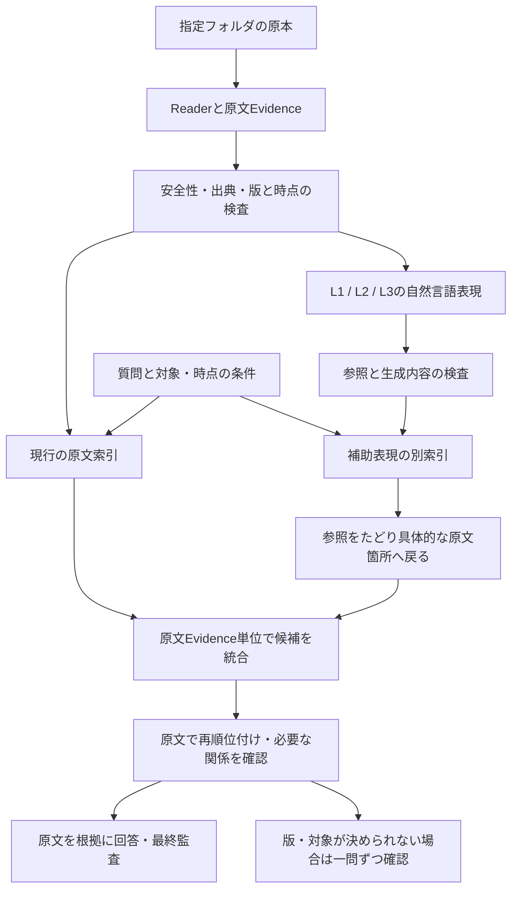

# Local Memory Search V2 実装計画

作成日: 2026-09-09。状態: 設計案。V2の実装・性能比較・配布更新は未実施。
優先順位変更: ユーザーの依頼によりV2は保留。[V1.00徹底強化計画](/Users/takashifukutomi/Documents/ChatGPT/AIエンジニアリングチャレンジ/design/local-memory-search-v1-00-hardening-plan-2026-09-09.md)を先に進める。
調査基点: `79a6926`。ここでの「V2」は製品構想名であり、既存の `answer_local_memory_v2.py` や配布版0.6の版番号とは別。

目標は、**資料について自然言語で残した複数の見方を検索の入口に加え、これまで見落としていた原文の根拠を見つけられるようにすること**。関連しそうな資料を増やすだけでは完成としない。正しい原文箇所に戻れること、従来答えられた問いを壊さないこと、迷う問いを適切に保留できることまで評価する。

## 1. 構想の定義と、先に固定する境界

ユーザーの「自然言語オンリーによる意味空間日誌的な三層構造」の正式な層定義は、今回確認した記録・設計書からは特定できなかった。前の会話で助手が挙げた「原文・文脈・時間的意味」は仮の説明であり、ユーザーの正式な提案として採用しない。

計画では三層を `L1 / L2 / L3` と呼ぶ。各層について、目的、入力範囲、出力する自然言語の例、禁止する推測、原文への戻り方、更新条件を短い「層定義」にする。層の名称と生成規則を差し替えても、検索・原文照合・評価の共通部分は利用できる設計とする。正式定義の確認は、三層の生成プロンプトを確定する前の条件。現行調査と評価器の設計は先行できる。

「自然言語オンリー」は、暫定的に**意味内容を人が読める文章として保存する**と解釈する。参照ID、日時、ハッシュ等は別の管理情報として持つ。Embeddingはその文章を探すための索引であり、日誌本文を置き換えない。「数値索引も使わない」という意図なら、自然言語の語彙検索・限定的なLLM照合を別案として比較する。この意味も層定義と一緒に確認する。

この構想は「三つの異なる数学的意味空間を必ず作る」という要件ではない。同じ埋め込みモデルで三つの表現を索引化してよい。今回の補助層は、明示的な関係を持つ既存グラフとも別の検索入口になる。

原文に存在しない情報や、Readerが読み取れなかった内容を、補助説明だけで復元したとは扱わない。説明の生成による追加表現は仮説を含み得る。出典ハッシュが一致しても、その説明の意味が正しいことまでは証明できない。

## 2. 現行実装から確認できた前提

| 現在の実装 | V2への影響 |
|---|---|
| 配布アプリの通常検索はEvidenceのEmbedding類似度と独自の字句・token coverageを合成する。式の係数は0.55 / 0.15 / 0.30。 | 三層追加の比較基準はこの実検索。係数を「精度への寄与率」や確率とは呼ばない。[C1] |
| 原本の抽出、SearchUnit、Local Memory Evidence、安全判定、SQLite索引、回答・監査が別工程になっている。 | 補助説明は安全判定済みEvidenceから作り、別索引へ保存できる。[C2][C3] |
| 同じリポジトリの `scripts/search_hybrid.py` にはBM25とEmbeddingをRRFで統合する別経路がある。 | 部品再利用の候補。ただし配布アプリとID・schema・検証契約が違うため、そのまま置き換えない。[C4] |
| Graph、版判定、機械検証、別コンテキストの最終監査が存在する。 | 補助検索がそれらを迂回しない。機械検証は参照・構造等を検査し、一般的な意味の真偽の保証にはしない。[C3][C5] |
| 直前の版判定追加ではhistorical / needs_human_review候補をReader前に除く。グループに属さない資料は通常対象に残る。 | 「古い原本を保持」と「古い内容も検索可能」は異なる。時間を扱うV2には、回答対象と保存対象の分離が必要。[C6] |
| 現行の評価schemaはSearchUnitの正解IDを中心にし、通常の評価器は正解が索引に存在することを要求する。 | V2用には原本位置・複数根拠・答えなし・確認待ち・抽出欠落も記録できる評価器が必要。[C7] |

グラフ検索は、図の幾何学的な形が似ている箇所を探す一般的な図形照合とは異なる。V2の説明でも「言葉の意味と関係を手掛かりに探す」という比喩に留める。

### P0: V2の前に解決する現行の接続・版判定

今回のコード調査で、`build_local_semantic_index.py` の `_attest_lineage_context()` はValidatorを3引数で呼ぶ一方、新しいValidatorは版グラフ結合がある状態で第4引数がなければ `unexpected_document_version_graph` で停止することを確認した。[C8] Reader単体の合格だけでは、本番と同じ索引公開経路の成功を確認できない。最初の実装単位としてこの受渡しを修正し、関連するcontextの厳密schema・再検証・世代登録も合わせて確認する。

版判定も次を受入条件へ加える。

- 年・版・現行マーカーのない同名候補を、候補集合から黙って落とさない。対象形式と未対応形式を列挙する。グループ未検出を「版の問題なし」としない。
- `unapproved` と `approved` の部分一致、`ver1.9 / ver1.10`、複数年を含むファイル、年と版番号の逆転、最新版の下書き、現行と廃止の同居を負例にする。
- 年ごとの報告書・実績表は別時点の記録かもしれない。共通名だけで旧年を失効させない。「同じ手順の改訂版」「時系列の別記録」「関連する別資料」を分ける。
- 作成日時、更新日時、索引で初めて観測した日時、業務で有効になる日時を分ける。「2025が2024より新しい」と「今の正本が2025」は別判定とする。調査対象の範囲と最終観測時刻を回答に持たせる。
- 人の選択はsource-root識別子、資料ファミリ、内容hash、決定時点に結合する。別フォルダの同名資料に判断を使い回さない。二重送信、再構築中の選択、別候補の削除で決定が混ざらないようにする。
- 候補が1件へ減った場合や、元資料が改名・移動した場合も、以前の確認待ちや判断の失効を追跡する。ハッシュと候補一覧を自分で書き換えた自己整合データでも、原本inventoryから集合を再構築して検出する。

受入は、少量の合成CSV/XLSX等で、Path Graph生成、版判定、Reader、安全判定、Graph再検証、安全索引公開、質問、確認画面、選択、再構築、変更後の再確認まで通す。推論をstubにした配線試験と、導入済みローカルモデルでの小規模な実機受入を分ける。外部データやモデルの追加取得を前提にしない。

P0修正前のsnapshotとP0通過後の基準線を両方残し、V2の比較には後者を使う。修正だけの改善を三層の効果へ加算しない。

## 3. V2の構成

日誌からの参照は「この原文を探す手掛かり」という関係。因果、正本、最新版、業務上の正しさを表すEdgeへ自動変換しない。生成文章を既存の `observed / verified` Evidenceへ追加しない。

三層は固定の一本道にせず、入口を並列に残す。上位説明の検索が外れたために原文検索も実行されない、という障害を避ける。初期実装は質問文をそのまま全検索へ送り、質問側の言い換え生成は後段の比較項目とする。

### 保存するもの

| 記録 | 主要項目と役割 |
|---|---|
| 層定義 | `layer_id`、自然言語での目的・例・禁止事項、対象単位、定義version |
| 補助表現 | `view_id`、`layer_id`、自然言語本文、chunk / section / documentの範囲、`authority=retrieval_hint` |
| 原文との結合 | 原本namespace、snapshot ID、Evidence ID、locator、本文hash、参照した全入力のhash |
| 生成記録 | `human / rule / model`、モデルdigest、prompt・設定・codeのhash、生成日時、入力範囲、切捨て・欠落 |
| 検証記録 | 形式検査と参照検査の結果、意味の確認方法、未解決理由、利用可能 / 保留 / 失効の状態 |
| 判断日誌 | 何を選んだか、誰が確認したか、根拠、対象範囲、有効時点、記録時点、訂正関係 |
| 検索trace | 元質問、条件、使った層、候補順位、原文へ戻した結果、除外理由、実行予算と各段階の時間 |

本文は自然言語。管理情報はSQLite等の機械可読形式とし、必要時にMarkdown表示する。人によるメモも「本人の申告・選択」という出所を持つ記録であり、既存資料の本文としては扱わない。

主張単位の説明と出典位置を可能な範囲で対応させる。参照先が存在するだけで意味的な支持を認定しない。生成時には原文抜粋も一緒に保存し、意味を変えた否定・人数・時点・因果の追加を検査する。意味判定にLLMを使う場合も誤りを見込み、不確かな説明はその層だけ保留する。

更新時は、入力内容・関連する判断・層定義・モデル・promptのいずれかが変われば、依存する補助表現を失効させる。修正履歴は追記して残すが、古い表現を現在の検索へ再投入しない。source-rootから除外された原本の派生索引も対象外にする。元の安全判定を継承し、複数入力を使う説明は全入力が対象範囲内であることを要求する。

### 検索から原文へ戻す手順

1. 元質問と明示された条件を保存する。対象・否定・単位・件数・基準日を、補助説明から勝手に書き換えない。
2. 同じ公開snapshotに対して、現行検索と補助検索を行う。安全性、時点、版、失効状態はランキング前に適用し、候補取得後も再確認する。
3. 補助表現のhitを原文Evidenceへ対応させる。文書全体の説明なら、その文書内を元質問で再検索する。関連しそうな文書名だけが取れても、回答可能とは判定しない。
4. 元のEvidenceとlocatorで重複をまとめる。一つの資料を三層で言い換えたことは、三つの独立した根拠にはならない。
5. 初期統合は順位ベースのweighted RRFを比較候補とする。検索スコアの尺度が違うまま単純加算しない。同じ層・同じEvidenceには最高順位の一票だけを与え、補助層全体の重みも上限付きにする。[S1]
6. 原文だけを使った再順位付けを行い、必要な前後文・表ヘッダー・関連Evidenceを同じ予算内で確保する。元検索のscoreだけで再度切り落とすと救済候補が消えるため、追加候補を残す方式も開発集合で比較する。
7. 回答生成・最終監査は原文と許可済みの構造情報を使う。View IDは引用不可とし、候補の本文を取得時点から原文に差し替える。補助説明の自由文を回答promptへ流し込まない。

件数集計・期間付き担当者など、既存の厳密な質問契約を持つ経路は、初期V2では変更しない。Graph不足や契約違反によるHOLDを、類似した文章の検索で解除しない。V2による救済対象は原文の取得不足であり、業務上の曖昧さは人の判断に戻す。

## 4. 試す方式と、見送る方式の条件

| 比較 | 確かめること | 採用を見送る条件 |
|---|---|---|
| A: P0通過後の現行検索 | 基準線 | 比較の土台として必ず残す |
| B: 原文だけの改善 | BM25、見出し・表ヘッダー補完、chunk範囲調整で足りるか | 個別の変更ごとに効果を測り、効果のない変更は採用しない |
| C: 文脈を一つ付ける | 三層化する前に、単純な文脈補足の効果を見る | 正確な文脈を足せない、または費用に見合わない |
| D: 資料側の三層 | どの層が新しい原文根拠を見つけるか | 三層が同じ言い換えに収束する、誤候補や更新費用が増える |
| E: 質問側のみの展開 | 文書生成をせず入口を増やせるか | 元質問にない条件・答え・時点を加える |
| F: 資料側＋質問側 | 両方に追加する価値があるか | D/E単独との差が小さい、検索の総当たりが高価 |
| G: 階層要約・複数文書の説明 | 長い資料や横断テーマを発見しやすくなるか | 原文への対応が粗い、更新連鎖が広い、別案件や版を混ぜる |

初期の中心はA/C/D。Bは強い対照として個別に試し、E/F/Gは前段で残った失敗に応じて追加する。全層の組合せを最初から常時実行しない。新しい埋め込みモデル、専用reranker、ANN索引、ColBERT型のtokenごとの表現は後段の代替案とし、三層生成と同時変更しない。[S4]

文脈補足による検索改善にはContextual Retrieval、抽象度の違う要約の検索にはRAPTORという先行例がある。ただし、これらはユーザーの三層の正式定義を示すものではなく、論文や他社の改善率をこのMacや日本語業務資料へ転用できるわけでもない。[S2][S3]

質問から仮想文書を作るHyDEも比較可能だが、生成文に架空の詳細が含まれ得る。採用する場合も検索時の仮説だけに限定し、原文・判断日誌の事実層には保存しない。[S5]

## 5. 弱点を潰す試験

| 失敗の可能性 | 防ぎ方・検出方法 | 失敗時の挙動 |
|---|---|---|
| もっともらしい説明に元資料が引っ張られる | 元質問・原文・追加説明を別に記録。追加条件を検査し、回答前は原文のみで支持確認 | 補助候補を棄却 |
| 要約で否定、例外、数字、単位が落ちる | 「可/不可」「原則/例外」、同じ数字で違う単位、改訂前後の逆転を対照例にする | 該当View保留、原文検索は継続 |
| 三層で同じ資料に重複投票する | 元Evidence・版・複製ごとに集約。層数と候補数を固定して比較 | 重み上限、重複を一票化 |
| 原文に戻してから検索順位が再び落ちる | Viewヒット、原文帰着、最終top-kを別々に計測 | 戻り先の範囲や再順位付けを再設計 |
| 新しいファイルを現行手順と誤認する | 発効日・廃止・承認・対象業務を別フィールド化。観測した範囲の「新しい候補」とする | 必要なとき一問ずつ人へ確認 |
| 過去の質問に現在の説明を混ぜる | 有効時点と記録時点を分け、as-of評価で将来資料・将来の判断を隠す | 対応可能な過去snapshotがなければ留保 |
| 旧資料を上流で除いたので時系列の説明が作れない | 原本保持と検索可否を分ける。時間層の試験は安全判定済みの履歴用索引を別に準備 | 初期版は現行資料検索に範囲を限定 |
| 日付のない別資料を同じ版として束ねる | scope、文書種別、業務上の同一性を確認。類似はファミリ候補に留める | 並列候補を維持 |
| 無関係な質問にまでHITLが出る | 問いに関係する候補群だけを確認対象にする。表示には理由と原文位置を付ける | 無関係な確認は出さない |
| 原文欠落・OCR誤読を検索不足だと思い込む | 正解が原本・抽出・索引のどこに存在するかを分けて計測 | Reader課題として切り分ける |
| 隔離資料の説明だけが検索へ漏れる | 入力の安全partitionを継承し、派生本文にも安全検査。最終原文の資格を再検査 | 派生表現ごと除外 |
| 日誌が前の日誌を根拠に増殖する | 各生成の入力を原文と明示的な人の記録に限定し、依存グラフで循環検出 | 循環・無出典を保留 |
| 原本変更・削除・scope変更後も古い説明を使う | 依存hashとsnapshotを再検証し、削除・除外を検索へ即時反映 | 失効、再生成待ち |
| 同じモデルで生成・監査して同じ誤解を通す | 決定的検査と人が固定した正解集合で評価。モデルの同意を独立証拠と数えない | 不確かな意味は保留 |
| 特定のカフェ名・ファイル名へ過適合する | 別部署・別名称・別人物・別年度へ置換した試験、無関係な近似資料を追加 | 特例辞書を一般改善と報告しない |
| ローカル生成が遅い・メモリを圧迫する | 初回/差分/質問時を別計測。生成は逐次・中断再開可能、同一snapshotだけcache再利用 | 補助層の処理を止め、健全な既存経路を使う |
| ハッシュを書き換えた偽の自己整合データ | 公開snapshotと出典から候補集合・結合を再構築。必要な登録を既存trust契約へ含める | 影響する世代を不採用 |

選択を依頼する画面では「AIの確信度」だけを見せず、候補の名称、該当原文、時点・版の手掛かり、迷っている理由を示す。「こちらを使う」「どちらでもない」「まだ決められない」を扱い、強制選択しない。人が決めた範囲を越えて、その選択を別の問いの正解や学習ラベルへ自動転用しない。

## 6. 評価の設計と採用条件

最初に約30問の開発用pilotを作り、失敗の型と計測器を確認する。内訳案は、言い換え・目的/状況10、固有ID/数字/否定5、新旧/時点/同名5、複数根拠5、答えなし/確認待ち5。これは実装開始の規模であり、性能保証に必要な標本数ではない。未知評価の規模は、pilotのばらつきと見たい差に合わせて決める。

開発用・調整用・最終評価用は原本ファミリ単位で分ける。同じ帳票、改訂版、複製、言い換え質問を別集合にまたがせない。正解は人が原本位置を確認して検索前に固定し、生成担当へ正解・評価用質問を渡さない。既知fixtureや資料の文章から自動生成した問いは配線・回帰テストと表示する。既存の小規模評価の成績は現在のV2の実測として使わない。

正解記録には、必要な原文箇所の集合、代替的に十分な根拠の組合せ、正しい版・時点、期待する挙動 `answer / clarify / abstain` を持たせる。単に一件ヒットすればよい問いと、複数箇所が全部必要な問いを分ける。原本にはあるが未抽出の根拠も記録し、検索評価から除外した件数を隠さない。

| 測る段階 | 指標 |
|---|---|
| Reader・索引 | 原本の必要箇所が抽出できた割合、検索資格のあるEvidenceとして保存された割合 |
| 候補検索 | 原文EvidenceのRecall@10/@20、Hit@k、MRR、段階評価ラベルがある場合のnDCG、資料ファミリの偏り |
| 原文への帰着 | View hitが有効な原文locatorへ戻れた率、戻った後のRecall、見出し/表ヘッダーを含む支持の充足 |
| 最終context | 同じtop-k・同じtoken上限でのPrecision、必要根拠集合を全部含む割合 |
| 回答 | 根拠付き正答率、従来正答を壊した件数、誤版採用、未支持主張、正しい確認・保留、過剰な保留 |
| 運用 | 初回生成時間、差分生成時間、検索/再順位付け/回答のp50・p95、メモリ・swap、索引bytes、HITL発生率と重複確認 |

比較時はモデルdigest、抽出snapshot、候補数、最終context token予算、回答prompt、採点方法を揃える。同一の最終文脈予算での品質比較と、総検索・推論時間予算まで揃える費用比較を別に出す。V2が多く計算した結果を、三層の表現だけの効果と混同しない。

各層を一つずつ外す試験、原文だけを長くする対照、質問だけを展開する対照を入れる。原文の必要箇所を意図的に削除した試験では、古い日誌・cacheが残っていても回答を棄却させる。再生成後の品質試験と、再生成前の失効試験を別に扱う。

数値の採用条件は、pilot後に固定して最終評価前に凍結する。初期提案は次のとおり。

- 言い換え・文脈群の原文Recall@10で基準線から絶対値5ポイント以上の改善を目指す。基準線が高く天井効果がある場合は別指標を評価前に選ぶ。
- 全体の固定予算Precision@10と根拠付き正答率は、非劣性幅1ポイントを暫定案とする。改善・退行の両方を資料ファミリ単位のpaired比較と信頼区間で報告する。
- 偽出典、隔離資料の引用、明示的な時点・否定の上書き、Viewの事実昇格、厳密な質問契約の迂回は、固定した安全・契約試験で0件を要求する。
- 不明な問いへの誤回答だけでなく、答えられる問いを全部保留にする退行も失格とする。少量試験で0件でも、実運用の誤り率がゼロだとは結論しない。
- 初期の検索・再順位付けp95は基準線の1.5倍以内を候補目標とする。低遅延の基準線では倍率だけで判断せず、絶対秒と対話全体の待ち時間も一緒に確認する。

30問では1ポイント程度の差を判定できない。pilotは方向性と不具合の発見に用い、信頼区間が採用条件を支えない間は実験扱いを続ける。三層方式が単純な文脈追加や原文改善を上回らなければ、少ない層・低コストの方式を採用する。

## 7. 実装順と完了条件

| 段階 | 実装する単位 | 完了条件 |
|---|---|---|
| P0 接続と基準線 | 版グラフの全呼出しへの伝播、候補集合/判断scopeの検査、通し試験 | 既存系が小規模fixtureを公開・検索でき、新旧競合と変更後の再確認が通る |
| P1 定義と評価器 | 三層定義の確定、質問分類、原本locator付き正解、予算とvariant manifest | 正解/期待保留が固定され、同じ入力で現行経路を再実行できる |
| P2 原文への参照を持つ小さな試作 | まず一つの層を人手/ルールで作成、次に同じ契約でローカル生成、参照検査・失効 | 固定した根拠へ100%帰着し、偽参照・変更・削除を検出。意味品質は別採点 |
| P3 別索引と比較 | 三層定義に沿ったview生成、別SQLite、候補統合、原文再順位付け、アブレーション | 固定予算でA/C/Dを比較でき、候補増加と正しい根拠増加を分けて報告 |
| P4 実質問のshadow | 現行回答が終わった後に低優先度で補助候補を計測 | ユーザー回答は現行のまま、差分・失効・停止・追加遅延を追跡できる |
| P5 限定利用 | 評価合格した問いの種類だけ、原文候補を回答へ渡して通常監査 | 新たな原文候補を含む回答も監査合格し、退行・過負荷時に戻せる |
| P6 範囲拡張 | 時点付き日誌、文書横断、質問側展開、履歴索引を一つずつ追加 | 各機能が固有の未解決問題を改善し、元の合格条件を維持する |

P2はまず20資料程度の小さな集合から始める。層に必要な入力がない資料には空の説明を作らず、理由付きで未生成とする。三層が揃わなくても原文検索は動く。P2で一層にも改善がなければ、その原因を確認してP3の全量生成へは進まない。

大きなモデルの生成とEmbedding計算はMac上で逐次実行し、回答要求を優先する。中断は文書単位で再開できるようにする。総生成時間は `対象数 × 実測した平均生成時間 ÷ 安全な並行数` を出発点に、長文分布・model切替・再試行を加味して見積もる。Path Graph作成の約1分という過去測定を、内容読取や日誌生成の時間へ流用しない。

索引容量は `追加ベクトル数 × 次元数 × 保存byte幅 + 本文 + 参照・SQLite overhead` で見積もる。三層という名称だけで容量が常に3倍になるとは限らない。実機のmodel digest、入力上限、空き容量、実測レイテンシをP1/P2で記録し、時間見積りを更新する。

### コードへの具体的な差し込み案

以下は新設・変更の予定で、今回これらのコードは作らない。

| 予定箇所 | 責務 |
|---|---|
| `engine/document_version_resolver.py`、`build_adaptive_semantic_graph.py`、`validate_adaptive_semantic_graph.py`、`build_local_semantic_index.py` | P0の伝播修正と版・時点・候補集合の契約整備 |
| `engine/semantic_view_contract.py`、`build_semantic_views.py`、`validate_semantic_views.py` | 層定義、原文参照、生成記録、意味検査・失効 |
| `engine/build_semantic_view_index.py`、`search_semantic_views.py` | 原文索引に結合した別索引の構築・検索 |
| `engine/retrieval_candidate_fusion.py` | Evidenceへの帰着、重複抑制、予算管理、原文再順位付け、trace |
| `engine/answer_local_memory_v2.py`、`app/local_memory_server.py` | shadow観測、対象限定での検索候補追加、確認画面 |
| `app/bootstrap.py`、`app/semantic_graph_trust.py`、`app/final_answer_audit.py` | 世代登録、原文以外の引用拒否、復旧、既存回答監査との契約 |
| `scripts/evaluate_semantic_view_retrieval.py`、専用eval schema | 原文locator中心の比較と答えなし/抽出欠落の評価 |

上表の `engine/` と `app/` は `distribution/macos-local-memory/` 配下。基盤のSearchUnit IDとアプリのEvidence IDには明示的な対応表を作り、接頭辞の書換え等で同一視しない。既存BM25/RRFや評価採点関数は、入出力契約を確認したうえで必要部分だけ利用する。

### 導入と元へ戻す方法

設定案は `semantic_views_mode = off / shadow / assist`。初期既定値は `off` とし、生成の実行と回答への利用を別に管理する。新索引は新しい世代へ作り、検証完了後に原子的に登録する。原文側のsnapshot・Graph・安全partition・版判定の結合が揃わない途中世代は公開しない。

補助索引だけが壊れた・未生成・timeoutの場合は、同じ有効snapshotの健全な既存経路を使う。元の安全判定や原文の整合性が失敗している場合は、fallbackでその失敗を迂回せず停止する。shadowのジョブは上限付きにし、連続質問でキューが膨らめば観測を省略した理由を記録する。

`assist` は対象を限定して有効化する。人に何度も「AI回答を承認」させる設計にはせず、利用開始後は原文の支持と既存監査で自動実行し、資料・対象・時点を決められない箇所だけ確認する。問題が出たら `off` に戻し、必要なら直前の検証済み世代へ参照を戻す。新索引やログは検証のため保持し、破壊的な復旧を通常手順にしない。

最初の実装着手範囲はP0とP1。三層生成の本格導入は、層定義と比較基準を固めてからP2へ進める。計画段階で「精度が上がった」「V2完成」とは扱わない。

## 8. 調査根拠

現行コードの行番号は調査時点。後続変更時は関数名から再確認する。

- [C1 通常のhybrid検索](/Users/takashifukutomi/Documents/ChatGPT/AIエンジニアリングチャレンジ/distribution/macos-local-memory/engine/answer_local_memory_v2.py:569)
- [C2 Readerから安全判定へ](/Users/takashifukutomi/Documents/ChatGPT/AIエンジニアリングチャレンジ/distribution/macos-local-memory/app/bootstrap.py:2133)
- [C3 配布アプリの説明と制約](/Users/takashifukutomi/Documents/ChatGPT/AIエンジニアリングチャレンジ/distribution/macos-local-memory/README.md)
- [C4 基盤側のweighted RRF](/Users/takashifukutomi/Documents/ChatGPT/AIエンジニアリングチャレンジ/scripts/search_hybrid.py:22)
- [C5 版判定](/Users/takashifukutomi/Documents/ChatGPT/AIエンジニアリングチャレンジ/distribution/macos-local-memory/engine/document_version_resolver.py:143)
- [C6 Readerの版フィルター](/Users/takashifukutomi/Documents/ChatGPT/AIエンジニアリングチャレンジ/distribution/macos-local-memory/engine/build_adaptive_semantic_graph.py:192)
- [C7 既存の評価器](/Users/takashifukutomi/Documents/ChatGPT/AIエンジニアリングチャレンジ/scripts/evaluate_lexical_retrieval.py:92)、[評価schema](/Users/takashifukutomi/Documents/ChatGPT/AIエンジニアリングチャレンジ/schemas/retrieval-eval-case.schema.json)
- [C8 索引側の再検証呼出し](/Users/takashifukutomi/Documents/ChatGPT/AIエンジニアリングチャレンジ/distribution/macos-local-memory/engine/build_local_semantic_index.py:833)、[版引数の検査](/Users/takashifukutomi/Documents/ChatGPT/AIエンジニアリングチャレンジ/distribution/macos-local-memory/engine/validate_adaptive_semantic_graph.py:2530)
- [S1 Cormack et al., Reciprocal Rank Fusion (SIGIR 2009)](https://cormack.uwaterloo.ca/cormacksigir09-rrf.pdf)：異なる検索の順位を統合する方式。V2では相関したviewの票数を制限する追加設計が必要。
- [S2 Anthropic, Contextual Retrieval (2024)](https://www.anthropic.com/engineering/contextual-retrieval)：chunk固有の文脈を補って索引化する先行例。一般要約の一律追加と同じ効果とは限らない。
- [S3 Sarthi et al., RAPTOR (2024)](https://arxiv.org/abs/2401.18059)：異なる抽象度の要約を検索する方式。ここでの三層構想と同一とは主張しない。
- [S4 Khattab & Zaharia, ColBERT (2020)](https://arxiv.org/abs/2004.12832)：細粒度表現のlate interactionを用いる別方式。自然言語viewを複数作る本計画とは区別する。
- [S5 Gao et al., HyDE (2022)](https://arxiv.org/abs/2212.10496)：仮想文書を検索の手掛かりにして実資料へ戻す方式。生成文の虚偽を排除できるという保証としては使わない。

計画作成にはcodex-graph-engineering-adapterの呼出し元確認・検証・rollbackの手順を適用した。既存の実装・設定・索引への変更はこの計画の成果物に含まない。
